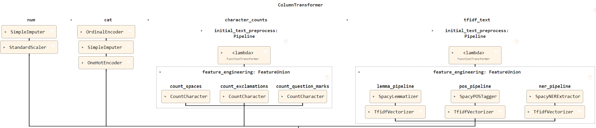
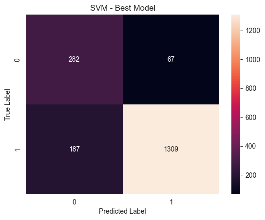
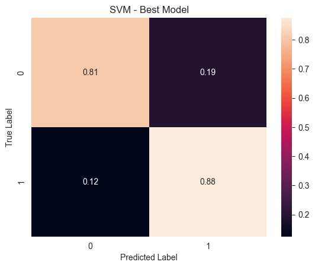

# Pipeline project - Build model to predict recommendations from fashion items review data

For this project, I built different machine learning pipelines to predict fashion article recommendations 
from review data, containing review texts and data about fashion article categories.

The features can be summarized as the following:

- **Clothing ID**: Integer Categorical variable that refers to the specific piece being reviewed.
- **Age**: Positive Integer variable of the reviewers age.
- **Title**: String variable for the title of the review.
- **Review Text**: String variable for the review body.
- **Positive Feedback Count**: Positive Integer documenting the number of other customers who found this review positive.
- **Division Name**: Categorical name of the product high level division.
- **Department Name**: Categorical name of the product department name.
- **Class Name**: Categorical name of the product class name.

The target:
- **Recommended IND**: Binary variable stating where the customer recommends the product where 1 is recommended, 0 is not recommended.

The aim of the project was to build a pipeline to transform the review data into a format that is usable by the machine learning model
and to predict if the review leads to an article recommendation.

## Getting Started

To get a copy of this repository, run the following command in your CLI:

````bash
git clone https://github.com/felix-r/dsnd-pipelines-project.git
````

### Dependencies

```
numpy
matplotlib
seaborn
scikit-learn
pandas
spacy
notebook
```

### Installation

To install the required python packages, run the following command in your python environment:

```
pip install -r requirements.txt
```

## License

[CC BY-NC-ND 4.0](https://creativecommons.org/licenses/by-nc-nd/4.0/https://creativecommons.org/licenses/by-nc-nd/4.0/)


## Project Description

The notebook `product_review_model.ipynb` contains the documentation to build a machine learning pipeline 
to predict the recommendation of an article based on text review data and other article category features.
To reproduce the results documented here, run the cells in the notebook.

__ATTENTION:__ The notebook contains grid searches with cross-validation for 3 models 
and the computation can take several hours depending on your machine.

The `starter` folder contains a starter notebook for initial analysis and the data folder.
The `documentation` folder contains files for illustrating the analysis process.

### Results
#### Data preparation
The data was split into a training and test set.
The data contains features of three different categories: numerical, categorical, and text.
Numerical data was preprocessed using a simple median imputer followed by standard scaling.
Categorical data was encoded using an ordinal encoder, followed by a simple imputer using most frequent values,
followed by one hot encoding.
The text data was preprocessed in a combination of different steps.
In an initial processing step the input array was transformed to 1D.
From there, different pipelines were created.
One pipeline computed character counts for spaces, exclamation marks, and question marks.
In another pipeline, the text was lemmatized, converted to POS-tags, or converted to NER tags 
followed by a Tf-idf vectorizer.
These steps were combined using a column transformer.
The following pipeline can be illustrated like this:


#### Classifier definition 
To test which classifier performs best for the given task, I trained models using a logistic regressor,
a support vector machine, and a random forest classifier.
All classifiers were initialized to use balanced class weights 
because `Recommended IND = 1` is largely overrepresented in the target data.

#### Hyperparameter fine tuning
For all three models, I performed a randomized grid search with three cross-validations to find the best parameters.
I used the F1-macro score to evaluate the fitted models to have a good balance of precision and recall for both classes.
I decided to use a macro-scoring because of the class imbalance in the taget data.

Here, an overview of the parameters used in the grid search:

__Logistic Regression:__
```python
{
'feature_engineering__num__standard_scaler': [MinMaxScaler(), StandardScaler()],
'feature_engineering__tfidf_text__feature_engineering__pos_pipeline__tfidf__ngram_range': [(1, 1), (1, 2), (1, 3)],
'logreg__C': [5, 10, 20],
'logreg__fit_intercept': [True, False],
'logreg__solver': ['lbfgs', 'liblinear']
}
```

__SVM:__
```python
{
'feature_engineering__tfidf_text__feature_engineering__pos_pipeline__tfidf__ngram_range': [(1, 1), (1, 2), (1, 3)],
'svm__C': [0.5, 1, 2.5, 5],
'svm__degree': [1, 2, 3, 4, 5],
'svm__shrinking': [True, False],
'svm__decision_function_shape': ['ovo', 'ovr'],
'svm__break_ties': [True, False],
'svm__gamma': ['scale', 'auto'],
'svm__kernel': ['linear', 'poly', 'rbf', 'sigmoid']
}
```

__Random Forest:__
```python
{
'feature_engineering__tfidf_text__feature_engineering__pos_pipeline__tfidf__ngram_range': [(1, 1), (1, 2), (1, 3)],
'random_forest__min_samples_split': [2, 4, 6, 8],
'random_forest__min_samples_leaf': [1, 2, 3, 4],
'random_forest__max_features': [40, 80, 100, 120],
'random_forest__n_estimators': [60, 80, 100, 150],
'random_forest__max_depth': [60, 80, 110],
}
```

The randomized search computed 40 iterations for the Logistic Regressor, and 50 iterations for teh other models.

#### Results
The best model turned out to be an SVM resulting in an F1-macro score of 0.801 using the following hyperparameters:
```python
{'svm__shrinking': True,
 'svm__kernel': 'linear',
 'svm__gamma': 'scale',
 'svm__degree': 5,
 'svm__decision_function_shape': 'ovr',
 'svm__break_ties': False,
 'svm__C': 1,
 'feature_engineering__tfidf_text__feature_engineering__pos_pipeline__tfidf__ngram_range': (1,
  2)}
```
This model resulted in the following confusion matrix:

  

The second plot shows a confusion matrix normalized for the true label.

#### Discussion & Conclusion

In this project, 3 classifiers were trained to model if a fashion item gets recommended
based on text reviews and article category data. 
Evaluation of a multitude of the models, optimizing for hyperparameters, resulted in an SVM model producing the best score.
It should be mentioned that the best Logistic Regression resulted in similar scores.
The models generally perfomed better at prediction label 1 
which is likely caused by an overrepresentation of this class in the data.

To improve the overall accuracy of the model, it would help to increase the number of entries for target label 0 in the training data.
Besides balancing the dataset for both target classes it would probably help to increase the size of the overall training set.
To improve the accuracy by adapting the model, it could be helpful to extract better features from the text data,
e.g. word counts, sentence complexity, or sentiment polarity scores.
The latter would require the use of pre-trained models/additional packages for text feature extraction (e.g. TextBlob, VADER).

An analysis of feature contribution in the final model could help to find out which features are really important 
and can help to reduce the complexity of the model while indicating where additional feature extraction can improve the model.

All in all, the models created here can serve as a good foundation to build more complex models for predicting recommendation.
The models already perform sufficiently well with accuracies over 80%.
